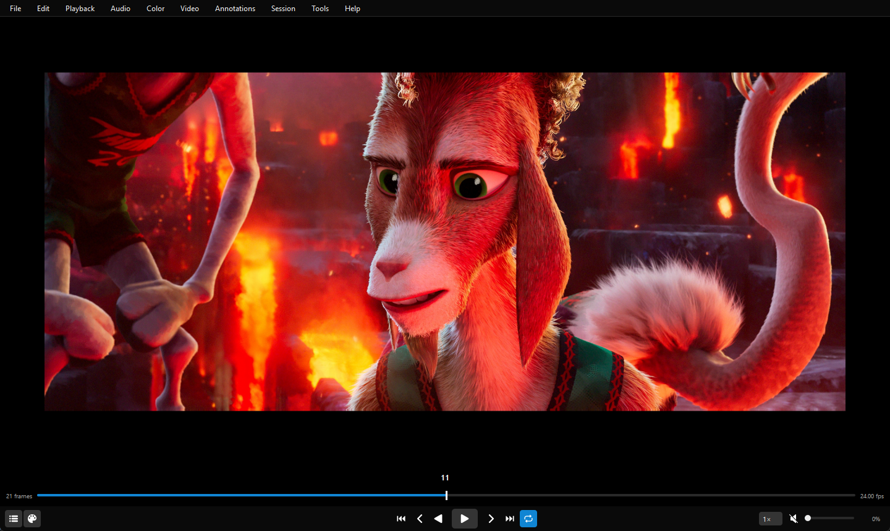
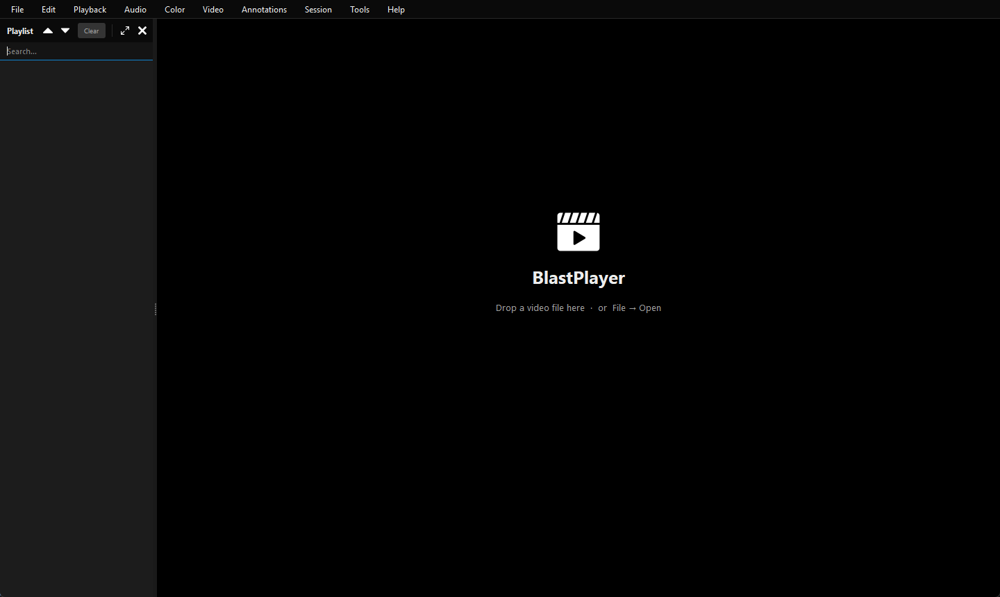
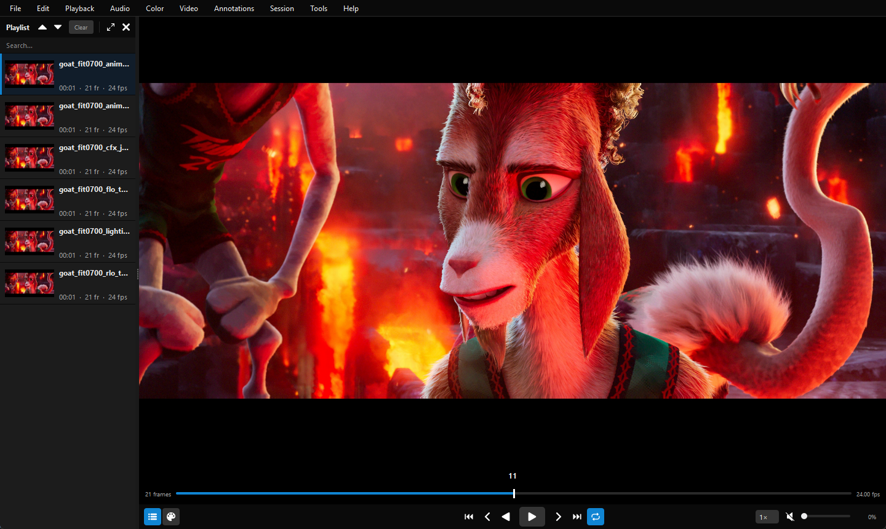
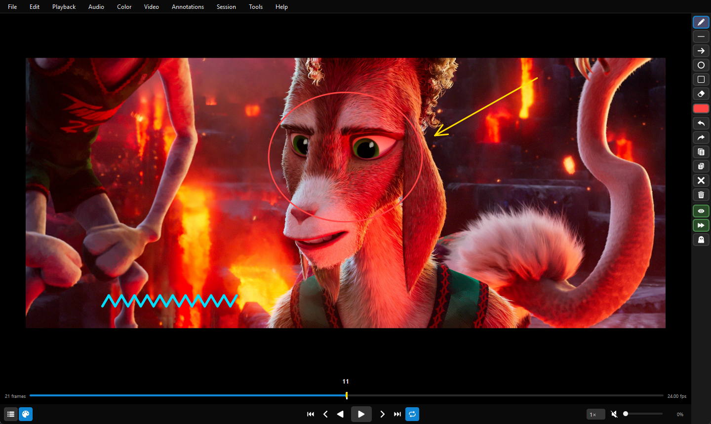
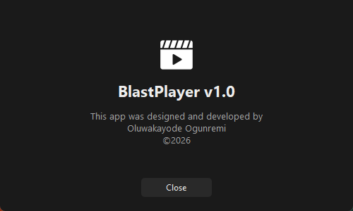

# BlastPlayer

**A frame-accurate review player for animation and VFX dailies.**

BlastPlayer is a desktop video player for studio review. It is built with PyQt5, FFmpeg and OpenGL, and handles 1080p through 4K footage. It offers frame-by-frame stepping with no perceptible delay, scrubbing with audio, draw-over annotations saved per frame, OCIO color management, and synchronized review sessions across machines on a LAN.



---

## Contents

- [Features](#features)
- [Screenshots](#screenshots)
- [Requirements](#requirements)
- [Installation](#installation)
- [Running BlastPlayer](#running-blastplayer)
- [Usage guide](#usage-guide)
  - [Opening media](#opening-media)
  - [Transport and timeline](#transport-and-timeline)
  - [Playlist](#playlist)
  - [Annotations](#annotations)
  - [Color management (OCIO)](#color-management-ocio)
  - [Review sessions](#review-sessions)
  - [BlastVault integration](#blastvault-integration)
- [Keyboard shortcuts](#keyboard-shortcuts)
- [Configuration](#configuration)
- [How it works](#how-it-works)
- [Project structure](#project-structure)
- [Troubleshooting](#troubleshooting)
- [Credits](#credits)

---

## Features

| Area | What you get |
|---|---|
| **Playback** | Frame-accurate playback forward and in reverse, at 0.25× to 2× speed. Playback is timed against the wall clock, so frames are held for exactly the right duration. |
| **Scrubbing** | Scrub the timeline with no perceptible delay, with optional audio scrubbing. |
| **Formats** | `.mp4`, `.mov`, `.avi`, `.mkv`, `.wmv`, `.flv`, `.webm`, plus **EXR / DPX image sequences** decoded as 16-bit HDR. |
| **GPU rendering** | Frames are drawn with OpenGL, with a GPU texture cache and pan, zoom, rotate and flip. |
| **Large files** | Clips that fit in memory are cached in full. Larger clips (feature length, 4K) use a sliding RAM window around the playhead. |
| **In / Out range** | Set In and Out points to limit playback and looping to part of a clip. |
| **Playlist** | A dockable sidebar with thumbnails, search, reordering, per-clip looping, and **multi-clip playback** of any selection as one continuous timeline. |
| **Annotations** | Pen, line, arrow, ellipse, rectangle and eraser tools. Undo/redo, copy/paste between frames, ghosting (onion-skin) of other annotated frames, and markers on the timeline. Annotations are saved as a JSON file next to the video. |
| **Color** | OpenColorIO support: load a config and choose the input color space, display and view. The transform runs on the GPU. |
| **Sessions** | One machine hosts a review; others join by IP address. Seeks, play/pause, annotation strokes and loaded media stay in sync for everyone. |
| **Studio integration** | Other tools, such as BlastVault, can send media to a running BlastPlayer through a request file. |

---

## Screenshots

### Welcome screen
Drop a file anywhere in the window, or use **File → Open**.



### Player
The video fills the canvas. The bottom bar shows the frame count, current frame, a full-width scrubber and fps. Below that is the transport row: playlist and annotation toggles on the left, navigation in the centre, speed and volume on the right.


### Playlist sidebar
Each clip has a thumbnail, duration, frame count and frame rate. You can search, reorder, dock, float and multi-select clips.



### Annotations
The annotation toolbar sits on the right edge. Draw with the pen, shape and arrow tools. Yellow markers on the scrubber show which frames have notes.



### About



---

## Requirements

| Requirement | Notes |
|---|---|
| **OS** | Windows 10/11 (primary). macOS and Linux are supported. |
| **Python** | 3.10 or newer (developed on 3.14). |
| **FFmpeg + ffprobe** | Required. Must be on `PATH` or in a standard install location (see [Configuration](#configuration)). |
| **GPU** | OpenGL 3.2-capable graphics driver. |
| **RAM** | 8 GB minimum. 16 GB or more recommended for 4K. |

Python packages:

| Package | Purpose | Required |
|---|---|---|
| `PyQt5` | UI framework | Yes |
| `PyOpenGL` | GPU rendering | Yes |
| `numpy` | Audio buffers | Yes |
| `sounddevice` | Low-latency audio output (PortAudio) | Yes |
| `opencolorio` | OCIO color management | Optional. The **Color** menu is disabled without it. |

---

## Installation

### 1. Install FFmpeg

**Windows:** download a build (for example from [gyan.dev](https://www.gyan.dev/ffmpeg/builds/)), extract it to `C:\ffmpeg`, and add `C:\ffmpeg\bin` to `PATH`.

**macOS:**
```bash
brew install ffmpeg
```

**Linux (Debian/Ubuntu):**
```bash
sudo apt install ffmpeg
```

Check that it is installed:
```bash
ffmpeg -version
ffprobe -version
```

### 2. Get the code

```bash
git clone https://github.com/kaywizzy123/BlastPlayer.git
cd BlastPlayer
```

### 3. Install Python dependencies

A virtual environment is recommended:

```bash
python -m venv .venv
# Windows
.venv\Scripts\activate
# macOS / Linux
source .venv/bin/activate

pip install PyQt5 PyOpenGL numpy sounddevice
pip install opencolorio      # optional, enables the Color menu
```

---

## Running BlastPlayer

```bash
# Open to the welcome screen
python main.py

# Open a single video
python main.py path/to/shot_v001.mov

# Open several videos as a playlist (the first one loads)
python main.py shot_v001.mov shot_v002.mov shot_v003.mov
```

> **Windows tip:** if several Python installs are on your machine, `python` may run one that doesn't have the dependencies. That gives errors such as `ModuleNotFoundError: No module named 'numpy'`. Either use the `py` launcher (`py main.py`) or run the interpreter where you installed the packages.

---

## Usage guide

### Opening media

- **File → Open…** (`Ctrl+O`)
- **Drag and drop** one or more files onto the window
- **Command line** arguments (see above)
- **Playlist → Add Videos…** (the `+` button, or right-click in the playlist)

For **EXR / DPX sequences**, open any frame of the sequence (for example `shot.1001.exr`). BlastPlayer works out the numbering pattern (`shot.%04d.exr`) and decodes the whole sequence in 16-bit.

### Transport and timeline

| Control | Action |
|---|---|
| ⏮ / ⏭ | Go to first / last frame |
| ‹ / › | Step back / forward one frame |
| ◀ / ▶ | Play backwards / play forwards (▶ also pauses) |
| Loop button | Loop the clip, or the In/Out range if one is set |
| Speed dropdown | 0.25×, 0.5×, 0.75×, 1×, 1.25×, 1.5×, 1.75×, 2× |
| Volume slider / speaker | Set the volume; click the speaker to mute |
| Scrubber | Click or drag to seek. Audio follows the scrub when **Audio → Audio Scrubbing** is on. |

**In / Out points:** press `[` and `]` to set the In and Out points at the current frame. Playback and looping then stay inside that range. `Ctrl+\` clears them.

**Stepping and scrubbing options** (**Playback → Stepping and Scrubbing**):
- **Loop on Step:** stepping past the last frame wraps around to the first.
- **Loop on Scrub:** dragging past the end of the scrubber wraps around to the start.

**Autoplay** (`Ctrl+A`) sets whether a newly opened clip starts playing straight away. When the playlist is in use, the next clip also plays automatically when the current one ends.

**View controls** (**Video** menu): fullscreen (`F11`; the controls hide automatically and reappear when you move the mouse), zoom with `Ctrl+=`, `Ctrl+-` or the mouse wheel, pan with a middle-mouse drag, reset with `Ctrl+0`, rotate 90° either way, and flip horizontally or vertically.

### Playlist

Toggle the playlist with the list button at the bottom left. The panel can be docked on either side or floated as a separate window.

- **Click** a clip to load it.
- **Search** filters the list by name.
- **▲ / ▼** move the selected clip up or down. **Clear** empties the list.
- **Right-click** a clip to:
  - **Add Videos…**
  - **Play Selected (N)**: with two or more clips selected, plays them back to back as one timeline. Scrubbing, audio and annotations work across clip boundaries.
  - **Loop this clip**
  - **Rename…** (changes the display name only)
  - **Remove**

### Annotations

Turn on the annotation toolbar with the palette button, or `Ctrl+Shift+A`.

| Tool | Description |
|---|---|
| ✎ Pen | Freehand strokes |
| — Line | Straight line |
| → Arrow | Line with an arrowhead |
| ○ Ellipse | Ellipse drawn from its bounding box |
| □ Rectangle | Rectangle |
| ⌫ Eraser | Erases strokes on the current frame |

- **Right-click** any tool to change its stroke size.
- The **color swatch** opens a color picker.
- **Undo / Redo** (`Ctrl+Z` / `Ctrl+Y`), **Copy / Paste** a frame's drawings to another frame, **Clear frame**, **Clear all**.
- The **eye** toggle shows or hides annotations. The **play** toggle sets whether they show during playback. The **ghost** toggle overlays drawings from other annotated frames at low opacity, for comparing poses across frames.
- Frames with annotations are marked on the scrubber.

**Saving:** use **Annotations → Save Annotations**. Drawings are stored next to the media as `<video filename>.annotations.json`, for example `shot_v001.mov.annotations.json`. They load again automatically the next time you open that file. If you close the app or switch clips with unsaved changes, BlastPlayer asks whether to **Save**, **Discard** or **Cancel**.

**Load All / Unload All Annotations** loads or unloads the saved annotation files for every clip in a multi-clip timeline at once.

### Color management (OCIO)

Requires the `opencolorio` package.

1. **Color → Load OCIO Config…** and choose a `config.ocio`. If you don't load one, BlastPlayer uses the `$OCIO` environment variable, then OCIO's built-in default.
2. Choose the **Input Color Space**, **Display** and **View**.
3. Turn on **Enable Color Management** (`Ctrl+Shift+C`).

The OCIO transform runs in a GPU shader, so it doesn't slow playback down.

### Review sessions

Several people can review together over the LAN, with one machine leading.

**To host:**
1. **Session → Host Session…**
2. BlastPlayer shows your address, for example `192.168.1.20:7734`. Share it with the other reviewers.
3. Click **Start Hosting**.

**To join:**
1. **Session → Join Session…**
2. Enter the host's IP address and connect.

While connected, followers mirror the host: the loaded clip, seeks, play/pause, and annotation strokes as they are drawn. People who join late are brought up to date with the current clip and frame straight away. If a follower doesn't have access to the host's file path, the host streams its frames as JPEG images instead.

Use **Session → Leave Session** to disconnect.

> Sessions use plain TCP on port **7734** and are neither encrypted nor authenticated. Use them only on a trusted studio network, and allow the port through the host's firewall.

### BlastVault integration

When BlastPlayer is running, it watches this file in the system temp directory:

```
<temp>/blastvault_player_request.txt
```

Any tool can write one or more file paths to it, one per line. BlastPlayer reads the file, deletes it, loads the media (one path opens a single video, several paths open a playlist) and brings its window to the front. BlastVault, the studio's asset browser, uses this to send shots to the player.

```python
from pathlib import Path
import tempfile
(Path(tempfile.gettempdir()) / "blastvault_player_request.txt").write_text(
    "C:/SHOWS/SAM/sequences/SEQ_01/SHOT_01/shot_v002.mov\n", encoding="utf-8")
```

---

## Keyboard shortcuts

### Playback
| Shortcut | Action |
|---|---|
| `Space` | Play / Pause |
| `L` | Play forwards |
| `J` | Play backwards |
| `K` | Pause |
| `←` / `→` | Step back / forward one frame |
| `Home` / `End` | Go to first / last frame |
| `[` / `]` | Set In / Out point |
| `Ctrl+\` | Clear In / Out |
| `Ctrl+A` | Toggle autoplay |
| `Ctrl+Shift+.` | Toggle Loop on Step |
| `Ctrl+Alt+.` | Toggle Loop on Scrub |

### Audio
| Shortcut | Action |
|---|---|
| `Shift+↑` / `Shift+↓` | Volume up / down (5%) |
| `Ctrl+M` | Mute |

### View
| Shortcut | Action |
|---|---|
| `F11` | Fullscreen (`Esc` exits) |
| `Ctrl+=` / `Ctrl+-` | Zoom in / out |
| `Ctrl+0` or `\` | Reset pan / zoom |
| `Ctrl+Shift+M` / `Ctrl+Shift+N` | Rotate clockwise / counter-clockwise |
| `Ctrl+X` / `Ctrl+Shift+X` | Flip horizontal / vertical |
| `Ctrl+Shift+C` | Toggle OCIO color management |

### Annotations & general
| Shortcut | Action |
|---|---|
| `Ctrl+Shift+A` | Toggle annotation toolbar |
| `Ctrl+Z` | Undo stroke |
| `Ctrl+Y` / `Ctrl+Shift+Z` | Redo stroke |
| `Ctrl+O` | Open file |
| `Ctrl+Q` | Quit |

---

## Configuration

Settings you can change live in [core/constants.py](core/constants.py):

| Constant | Default | Meaning |
|---|---|---|
| `FFMPEG_PATH` | auto-detected | Looks on `PATH` first, then `C:\ffmpeg\bin`, `C:\Program Files\ffmpeg\bin` (Windows), then Homebrew or MacPorts paths (macOS) or `/usr/bin` (Linux). |
| `GPU_CACHE_MAX_MB` | `1024` | Maximum size of the GPU texture cache. |
| `OCIO_CONFIG_PATH` | `""` | Default OCIO config. If empty, `$OCIO` or the built-in default is used. |
| `VIDEO_EXTS` / `EXR_EXTS` | see file | File extensions BlastPlayer accepts. |

BlastPlayer remembers your preferences between runs using `QSettings` (the registry on Windows, a plist on macOS). These include volume and mute, autoplay, loop, loop on step or scrub, audio scrubbing, playback speed, and window position and size.

---

## How it works

```
BlastPlayerWindow (QMainWindow)
├── Menu bar
├── Playlist dock (PlaylistSidebar)
└── QStackedWidget
    ├── WelcomeWidget
    └── PlayerWidget
        ├── AnnotationPanel      (right-edge toolbar)
        ├── VideoCanvas          (QOpenGLWidget + annotation overlay)
        └── Bottom bar           (info row · ScrubberSlider · transport)
```

**Decoding.** `ffprobe` reads each file's metadata: fps, dimensions and frame count. During playback, a long-running `ffmpeg` process streams raw RGB frames through a pipe, with hardware decoding (`-hwaccel auto`) where available. Single-frame seeks for stepping and scrubbing use a separate, fast `ffmpeg` call without hardware decoding, because starting a hardware decoder adds 100–500 ms to each call.

**Two-tier frame cache.**
- **Tier 1: full cache.** If a clip's decoded size is 2 GB or less, every frame is decoded into RAM in the background shortly after the clip loads. Scrubbing and playback then happen with no decoding delay.
- **Tier 2: sliding window.** Larger clips keep a window of up to 4 GB of frames around the playhead, with about 65% of it ahead of the playhead and 35% behind. Two background ffmpeg processes fill the window forwards and backwards, and the window moves to the new position when you release the scrubber. At that budget the window holds roughly 680 frames at 1080p or 170 at 4K.

**Rendering.** Frames are uploaded to OpenGL textures, streamed through pixel buffer objects (PBOs), and drawn by a shader. That shader also applies the OCIO transform when color management is on. HDR sources use 16-bit textures.

**Audio.** `AudioEngine` decodes the audio track once into a float32 NumPy array. A single `sounddevice` output stream stays open the whole time and switches between *stopped*, *playing* and *scrubbing*, so play and scrub never wait for a process to start. Video timing follows the wall clock (`time.monotonic()`), not the audio callback.

**Sessions.** `SessionServer` and `SessionClient` send newline-delimited JSON messages over TCP: `load`, `seek`, `play`, `pause`, `stroke`, `clear_frame`, `clear_all` and `frame`.

---

## Project structure

```
BlastPlayer/
├── main.py                  # Entry point: QApplication, CLI args, BlastVault file watcher
├── player_window.py         # Main window, PlayerWidget, VideoCanvas, playlist, decoding
├── core/
│   ├── constants.py         # Palette, file extensions, FFmpeg path, cache sizes
│   ├── styles.py            # Global Qt stylesheet, dark-mode platform args
│   ├── audio_engine.py      # PCM decode + sounddevice playback / scrubbing
│   ├── annotation_layer.py  # Per-frame strokes, undo/redo, JSON storage
│   ├── ocio_manager.py      # PyOpenColorIO wrapper → GPU shader + LUTs
│   └── session.py           # LAN review session server / client
├── ui/
│   ├── welcome_widget.py    # Empty-state screen
│   ├── scrubber.py          # Timeline slider with in/out and annotation markers
│   └── annotation_panel.py  # Annotation toolbar
├── dialogs/
│   ├── about_dialog.py
│   └── ann_save_dialog.py   # Save / Discard / Cancel prompt
├── icons/                   # UI icons
└── docs/screenshots/        # Images used in this README
```

---

## Troubleshooting

| Problem | Fix |
|---|---|
| `ModuleNotFoundError: No module named 'numpy'` (or `PyQt5`, `sounddevice`) | The `python` you ran doesn't have the dependencies. Install them into that interpreter, or use the one you installed them into (`py main.py` on Windows). |
| `PyOpenGL is required for GPU rendering` | `pip install PyOpenGL` |
| "Cannot open" when loading a file | Check that `ffmpeg -version` and `ffprobe -version` work in a terminal, or set `FFMPEG_PATH` in `core/constants.py`. |
| The Color menu reads "install opencolorio" | `pip install opencolorio` |
| No sound | Check the volume and mute in the player and in the OS. `sounddevice` uses the system's default output device. |
| Stuttering on 4K clips | Close other memory-heavy apps. On 8 GB machines, large clips use the sliding window, and the first pass through a section can be slower while it caches. |
| A follower can't join a session | Allow TCP port 7734 through the host's firewall, and make sure both machines are on the same network. |

---

## Credits

Designed and developed by **Oluwakayode Ogunremi** © 2026.

Built with [PyQt5](https://www.riverbankcomputing.com/software/pyqt/), [FFmpeg](https://ffmpeg.org/), [PyOpenGL](https://pyopengl.sourceforge.net/), [python-sounddevice](https://python-sounddevice.readthedocs.io/) and [OpenColorIO](https://opencolorio.org/).
